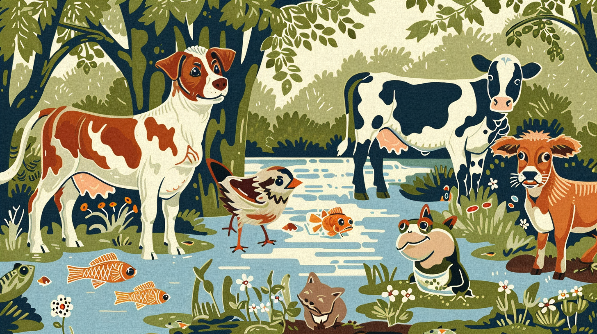
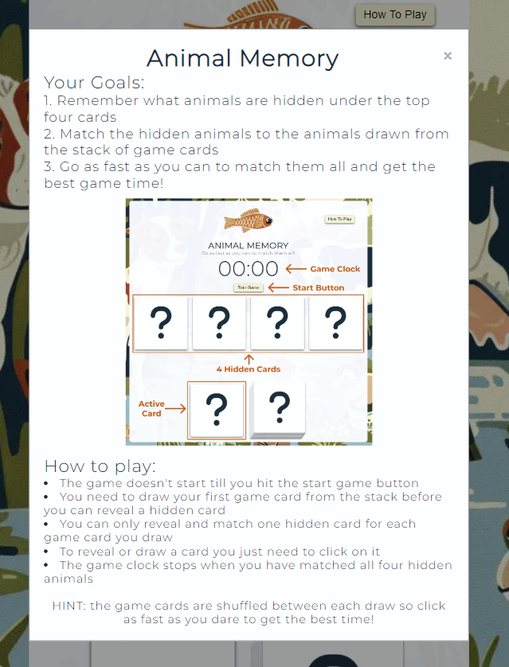
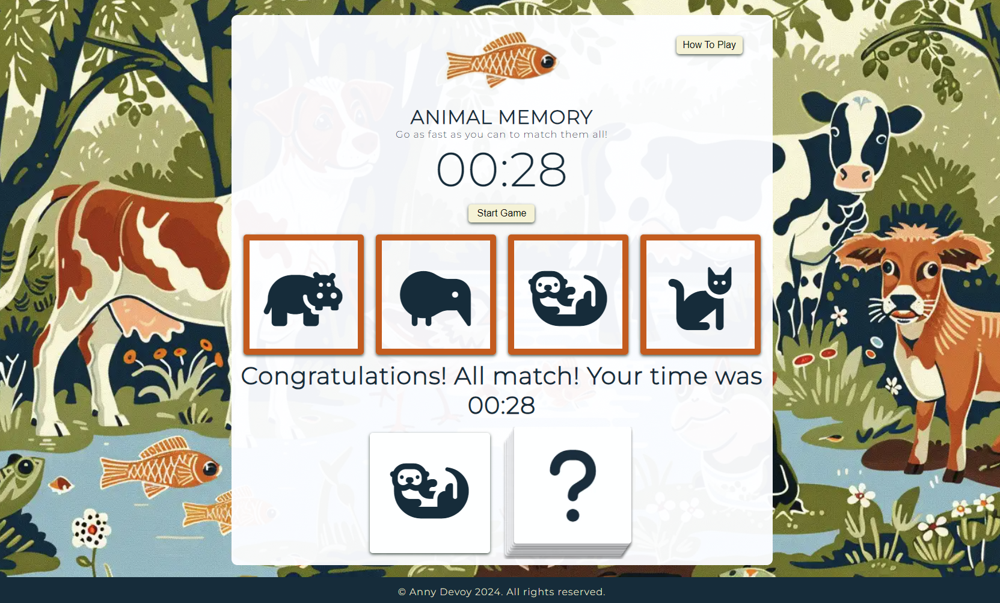
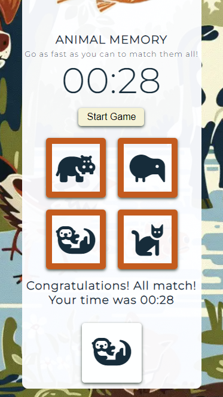
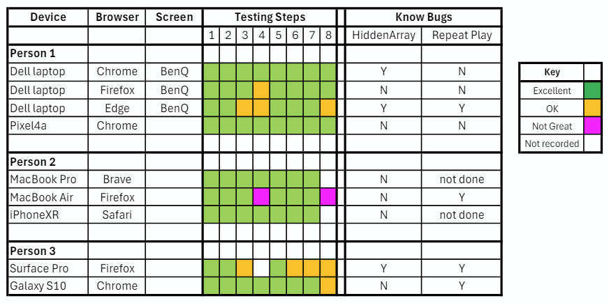

# Animal Memory Game

A JavaScript memory game 

Remember what animals are on the hidden cards and match them to your active card as quickly as you can!

The live game can be found [here](https://annytomica.github.io/memory_game/)

## Features
### Existing features
#### Background image
The background image, depicting a british woodland scene with animals in very graphic retro illustration style, was generated in MidJourney. It is a humourously weird and engaging picture with a warm palette that draws the eye of the game visitor. The dog-cows are a personal favorite.

#### Logo
The logo is a fish that was cropped from the bottom left of the background image. Background color was removed using photoshop. 

A matching favicon was generated using [Favicon.io](https://favicon.io/favicon-converter/)

#### Game instructions modal
Importantly, there is a 'How To Play' button which brings up a game instructions modal.

The modal has three sections:
- goals - what the aim of the game is
- diagram - visually shows what and where the important game features are
- game-play - step by step instructions on how to play the game.

#### Game area
The game area floats above the background image. The features use the colour palette drawn from the background image providing a visual flow and link.

The game area has four main sections:
1. The header - where the game starts. Besides the logo and title, the instructions modal, game clock and the start button are the key game features in this section.
2. The hidden animal cards - on larger screens they are displayed as a row of four cards, on tablet and mobile they stack 2x2. The default icon displayed is a ?. Once an animal is matched the card gets a thick orange boarder and is locked so the animal icon no longer reverts to a question mark.

3. The message area - where match, no match and final game over congratulations messages are displayed dynamically as the game is played.
4. The active game card stack - The active card is displayed beside an image of stacked cards on larger screens. On mobile devices the stack image disapears to avoid cluttering the game area.

#### Footer
A very simple footer with name and copyright

### Features for the future
#### Scoreboard
Provide the ability for the player to enter thier name, and along with thier time, submit it to a leaderboard. The game will have a small top10 displayed to the side of the game area on larger screens.

#### Increasing difficulty
Right now the game is very straightforward. Higher levels can be added by increasing the number of animals in the stack and the number of hidden animals.

## Site Design Process
### Goal
The goal was to create a simple and fun memory game
- interface easy to understand and use
- use animal icons so each card easy to identify and match
- game functionality created using JavaScript
- a game where you can compete against yourself or others by timing completion speed

### Visual Identity
The theme was british woodland animals and a simple yet fun background image was generated in MidJourney, from which the rest of the visuals were developed.

#### Logo
The fish logo was taken from the background image, with background removed in Adobe Photoshop

#### Colour Palette
The simple colour palette was generated in Figma, extracting three key colours from the background image generated in MidJourney. 

#### Animal Icons
Icons from Font Awesome were used for the animal cards as they were simple, crisp vector graphics and easy to distinguish from each other.
Not all animals matched the woodland theme, but considering MidJourney drew a cow-dog in the background image, accuracy is not something to worry about.

### Wireframe
The game wireframe and visual design was created in Figma. The wireframe with basic game format was created first, then once a background image was generated, the visual style of the game was developed and mocked up. The wireframe can be accessed [here](assets/readme/wireframe.png)

### Development process
The game was constructed with a logical flow. First, creating the game in empty box format to replicate the wireframe before starting to add functions and content. The javascript fucntions were then added to the game, so that the game was playable from teh wireframe format. Finally, the game visual styling, images and responsivity was added. Some of the original design concept was not working when incorporating responsive design features, such as the placement of the how to play button, and were adapted. The wireframe was updated to reflect these changes. 

## Technologies
- HTML – for basic site structure
- CSS – for visual appeal and responsive design features
- JavaScript - for all game functions
- GenAI – creation of game clock
    - Midjourney - background image and logo
    - ChatGPT 3.5 – HTML and JavaScript code for game clock
- Figma – wireframe and visual concept development
- Adobe Photoshop – Adjustment of image sizing and modification of logo
- Pixelied.com – conversion of jpeg and png image files to webp for efficient loading
- Favicon.io – generation of favicon from logo design.
- UI.dev – amiresponsive was used to test each page responsivity to screen size and create site mockup images.

## Testing
### General Strategy
The game was deployed very early on github pages, when just the basic HTML structure was ready. This allowed daily assessment of functionality of game elements and helped identify any issues quickly so they could be fixed before moving on to new features. Gitpod was used as the IDE and the site was run on a server live during development so code could be assessed immediately. Chrome Devtools were actively used during gitpod coding sessions so any errors thrown to the console could be seen immediately and fed back into the troubleshooting process. Devtools was also used to test responsive features for different screen sizes as they were developed. Changes to code were pushed multiple times a day. Using this strategy most bugs and functionality issues were identified and resolved quickly before they became a major issue for the game. The hidden card and active card arrays were logged to the console for each game, so the functionality of the array producing functions could be checked.

Once the game development was complete the game was loaded using various devices and browsers detailed below. The game was assessed each time with the following strategy:
1. Test modal for instructions loads and is visible, legible and formatted correctly.
2. Test that all cards are not active before game starts.
3. Test that on game start the clock begins, hidden cards still are inactive and the first active game card can be drawn.
4. Play the game to see if correct messages are popping up for correct and incorrect matches.
5. Check that only one hidden card can be selected with every draw of active game card.
6. Once 3 cards have been matched run through the active stack of cards drawing 20+ times to confirm that the matched animals have been removed from the stack correctly.
7. Match the final card and assess whether final message displays correctly and game clock stops.
8. Check that all game features reset when a new game is started.

After all game features were confirmed as functional the final html, css, js and accessibility validations were carried out.

### Devices and Browsers
#### Web Browsers
Chrome (primary), Firefox , Edge and Brave

#### Devices
- Phones: Pixel4a, iPhoneXR, GalaxyS10
- Tablets: iPad 9.5”, Surface Pro 12” (older model)
- Laptops: Dell Inspirion 13”, MacBook Air 13”, MacBook Pro 17" (older model)
- Desktop screens: BenQ PD series 27”

#### Testing Summary

### Final Validation
HTML – the game passed validation with no errors detected using the official [W3C HTML validator](https://validator.w3.org/). One warning was present - the h1 where the game messages are displayed has a default of being empty on game loading. The summary of results can be found [here](assets/readme/html-validation.png)

CSS – the game passed validation with no errors detected using the official [W3C CSS validator](https://jigsaw.w3.org/css-validator/). The summary of results can be found [here](assets/readme/css-validation.png)

JavaScript - the game passed vaildation with no errors detected using [JS Hint](https://jshint.com/). The summary of results can be found [here](assets/readme/jshint_summary.png)

Accessibility – the desktop game had perfect scores using Chrome [Lighthouse DevTools](https://developer.chrome.com/docs/lighthouse/). The mobile version was almost perfect, with slightly reduced performace. The summary of results can be found [here](assets/readme/lighthouse-validation.png)

## Bugs
### Fixed
- a hidden aria label "aria-hidden="true" appears in active card icon code and prevents a correct match to hidden card. Do not know where this aria label comes from or how to prevent. FIX: added the aria-hidden="true" to the icon code in the animalCodeAllocator function.
- function allMatch only works sometimes. Unclear what prevents it from running correctly every time. FIX: coder error - had only put the allMAtch function in event listener for hidden4, not all the hidden cards.
- icon for hidden animal not displaying when card clicked (after cleaning up repeated code) but is correctly identified for the match function. FIX: changed this.innerHTML to hiddenCard.innerHTML within the cardMatchCheck funtion
- animalCards.filter function does not remove animal from animalCards array, in spite of function working in python tutor. FIX: required restating the array with animalCards = animalCards.filter() to commit the array change as the animalCards.filter() alone does not change array permanently
- removeListener function is not working and does not inactivate hidden cards after first click. FIX: emptied hiddenCards array after click, rather than use removeEventListener which I could not get to work. Also had to change from using .forEach to iterate through hiddenCards array to normal for loop - I still don't quite understand why not using forEach made a difference, it was desperation not knowledge that made me try this.
NB: This throws a TypeError to the console when array is empty as it recognises hiddenAnimalAllocator function would return undefined if called. This is not an issue as that function is never called when the array is empty and game play is unaffected.

### Unfixed
- occassionally an animal is not removed from the active card array after being matched. It is not clear why this occurs as the function works 99% of the time. It happens when cards are being clicked extremely quickly. No error is thrown to console if this happens.
- on older devices (old Surface Pro) repeated game plays of 6+ times leads to the game not working properly, with slow responsivity and increased liklihood of the above bug occurring. Possible the accumulation of TypeErrors may be contributing. This needs further investigation.
- on older devices the match orange border can display on a hidden card that has not been matched correctly. The hidden card stays active and game-play continues. Unknown what causes this.

## Deployment
The site was deployed to GitHub pages using the recommended process.

In Summary:
1.	Within the GitHub repository for this project, the settings tab at the top of the page was accessed.
2.	From settings, the Pages tab was selected from the menu on the left side of the screen (within the Code and Automation section of the menu).
3.	From Pages, the Source was set to ‘Deploy from a Branch’, and the Branch was set to ‘main’.
4.	Once main branch is selected, hit the save button (ignore the folder/(root) menu).
5.	Once saved, the link to the active site will appear at the top of the page.
6.	Alternatively, from the main repository page, within the menu on the right a ‘Deployments’ will now have appeared. This section provides a link to the active site as well as summarizes the number of updates the site has received since initial deployment.

The github repository for this project can be found [here](https://github.com/Annytomica/memory_game/)

If you wish to develop this game further, feel free. To do this, create a fork of this repository and save it to your own github profile. To do this, use the fork button at the top right of this repository. This brings you to a new window, where you select yourself as the owner and can add extra details to name and description of the repo. If you chose to do this, please be respectful and credit me as the origin of this project and code.

## Credits
I would like to acknowledge and thank the following people and resources used in the creation of this site.
### Content

-	the Durstenfeld shuffle algorithm
    - Durstenfeld, R. (July 1964). "Algorithm 235: Random permutation". Communications of the ACM. 7 (7): 420.
    - is an optimised version of the Fisher-Yates shuffle ( Fisher, Ronald A.; Yates, Frank (1948). Statistical tables for biological, agricultural and medical research (3rd ed.). London: Oliver & Boyd. pp. 26–27.)
    - the optimised JavaScript code was taken from ashleedawg's update of Laurens Holst answer on stackoverflow, comment [1199](https://stackoverflow.com/questions/2450954/how-to-randomize-shuffle-a-javascript-array)

- the game clock code was generated by ChatGPTv3.5 (both HTML and JavaScript). CSS styling was my own.

- the Game Instructions modal was based on the tryhow modal example from [W3Schools](https://www.w3schools.com/howto/tryit.asp?filename=tryhow_css_modal)

- The DOM loading event listener was taken from the Code Institute Love Maths walkthrough project. The code can be found [here](https://github.com/Code-Institute-Solutions/love-maths-2.0-sourcecode/tree/master/05-tidying-up/01-a-few-last-things)

- [W3schools](https://www.w3schools.com/) was used repeatedly for tutorial guidance on array methods and properties.

- [freecodecamp](https://www.freecodecamp.org/) was used for guidance on how to use the .filter() and .forEach() array methods, and arrow functions.

- [Medium.com](https://medium.com/) was used for guidance on cool features to use in README.md

### Media
-	The icons in the logo and all game cards are from [Font Awesome](https://fontawesome.com/)
-	The Github summary bar used in README.md is from [shields.io](https://shields.io/badges/)

### Acknowledgements

My mentor, Oluwafemi Medale, for his invaluable guidance and feedback. In particular, introducing me to the use of forEach() and arrow functions and suggesting the use of a modal for game instructions.
